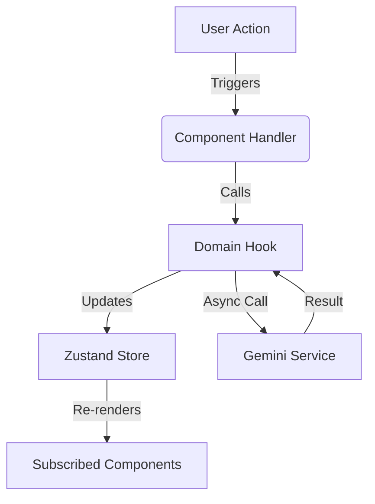

# Architecture Documentation

## Overview
Rtios AI is built on a **Domain-Driven Design (DDD)** principle, strictly separating business logic (Domains) from UI concerns (Components) and State Management (Stores). This ensures scalability, maintainability, and testability.

## 1. State Management (Zustand)
We use **Zustand** for global state management due to its minimal boilerplate and performance.

### Stores
- **`appStore`**: Manages UI persistence state.
  - *Slices*: Navigation sidebar, active views, modals.
  - *Persistence*: Uses `persist` middleware to save view preferences to `localStorage`.
- **`workspaceStore`**: Manages the core application data flow.
  - *Slices*: Resume parsing, text extraction, analysis results, generated content.
  - *Persistence*: Persists workspace state to prevent data loss on refresh.
- **`toastStore`**: Ephemeral UI notifications.
  - *Behavior*: Auto-dismissing alerts for success/error feedback.

### Data Flow

## 2. Component Hierarchy
The application follows a strict hierarchy to manage complexity:

1.  **Routes (`src/routes/`)**: Top-level page layouts (lazy loaded).
    - `AppView`: Main application shell.
    - `DashboardView`: Management interface.
2.  **Layouts (`src/components/layout/`)**: Persistent UI frames.
    - `NavigationSidebar`: Primary navigation.
    - `RightSidebar`: Context-aware tools.
3.  **Features (`src/features/`)**: Self-contained business flows.
    - `CoverLetterFeature`: Generation wizard.
    - `LinkedInFeature`: Message creator.
    - `InterviewPrepFeature`: Question simulator.
4.  **Components (`src/components/`)**: Reusable UI atoms and molecules.
    - `InputForm`, `Toast`, `ErrorBoundary`.

## 3. Error Handling Strategy
We implement a multi-layered error defense strategy:

1.  **Global Error Boundary (`ErrorBoundary.tsx`)**:
    - Catches catastrophic React render errors.
    - Displays a "Something went wrong" fallback.
2.  **Feature Boundaries (`FeatureErrorBoundary.tsx`)**:
    - Wraps individual features (e.g., Cover Letter Generator).
    - If a feature crashes, the rest of the app remains functional.
3.  **Service Handling (`errorService.ts`)**:
    - Centralized error logging and parsing.
    - Converts API errors (Gemini) into user-friendly messages.
4.  **UI Feedback (`useToastStore`)**:
    - Displays transient error messages to users without blocking workflow.

## 4. Type Safety
The project adheres to **Strict TypeScript** (`strict: true`) guidelines:

- **No `any`**: Explicit types required for all variables and functions.
- **Shared Types (`src/types.ts`)**: Central repository for domain models (`JobInfo`, `UserProfile`, `AnalysisResult`).
- **Null Safety**: Strict null checks enabled to prevent runtime null pointer exceptions.

## 5. Performance Optimizations
- **Code Splitting**: Route-level splitting using `React.lazy` and `Suspense`.
- **Lazy Components**: Heavy widgets (Recharts) loaded on-demand.
- **Vendor Splitting**: Separate chunks for `react`, `ui` libs, and `utils` to maximize cache hits.
- **Shallow Selection**: Use `useShallow` with Zustand to prevent unnecessary re-renders when selecting state slices.
