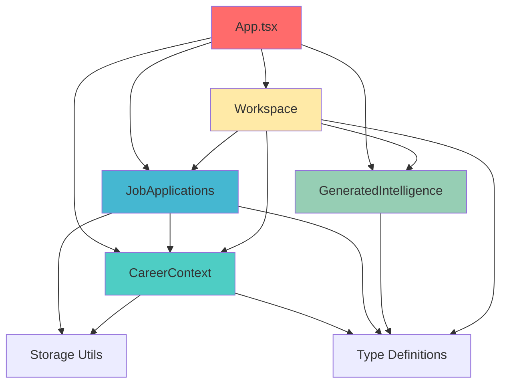

# Domain Boundaries & Ownership

## Overview

This document defines the four core domains of the Rtios AI application, their ownership boundaries, invariants, and dependency rules.

## Domain Definitions

### 1. CareerContext (Global)

**What it owns:**
- Resume library (currently: single resume only)
- User profile links (portfolio URL, LinkedIn URL)
- Active resume selection state

**Invariants:**
- ✅ **Single resume only**: The system enforces one resume at a time
- ✅ Resumes are global (not tied to specific jobs)
- ✅ Portfolio and LinkedIn URLs are global profile attributes

**Current implementation:**
- State: `resumes: SavedResume[]`, `activeResumeId: string | null`, `userProfile: UserProfile`
- Types: `SavedResume`, `UserProfile` (in `types.ts`)
- Storage: persisted via `utils/storageUtils.ts`

**Where code goes:**
- `hooks/useCareerContext.ts` (future: state + CRUD operations)
- `services/careerStorage.ts` (future: persistence adapter)
- `types/career.ts` (future: domain-specific types)

---

### 2. JobApplications (Per-Job)

**What it owns:**
- Job list (title, company, description, URLs, metadata)
- Active job selection
- **Job-owned outputs/history** (research, analysis, cover letter, LinkedIn, interview prep)
- Job-to-resume linkage (via `activeResumeId` in current implementation)

**Invariants:**
- ✅ **Outputs belong to jobs**: Each job stores its generated artifacts in `JobInfo.outputs`
- ✅ Jobs are independent (switching jobs preserves state via snapshot/hydration)
- ✅ Job deletion cascades to outputs

**Current implementation:**
- State: `jobs: JobInfo[]`, `activeJobId: string | null`
- Types: `JobInfo`, `JobOutputs` (in `types.ts`)
- Storage: persisted via `utils/storageUtils.ts`
- Logic: Snapshot/hydration in `App.tsx` (lines 108-241) ⚠️ **violation**

**Where code goes:**
- `hooks/useJobApplications.ts` (future: job CRUD + selection)
- `hooks/useJobOutputs.ts` (future: snapshot/hydration orchestration)
- `services/jobStorage.ts` (future: persistence adapter)
- `controllers/JobApplicationController.ts` (future: snapshot/hydration logic)
- `types/job.ts` (future: domain-specific types)

---

### 3. GeneratedIntelligence (Pure Capabilities)

**What it owns:**
- AI generation functions (stateless, pure capabilities):
  - `researchCompany`
  - `analyzeResume`
  - `generateCoverLetter`
  - `generateLinkedInMessage`
  - `generateInterviewQuestions`
  - `extractResumeText`
  - `extractJobFromUrl`

**Invariants:**
- ✅ **Pure and stateless**: No internal state ownership
- ✅ **No UI/Workspace dependencies**: Cannot import from UI, Workspace, or storage layers
- ✅ **No persistence**: Does not read/write to storage directly

**Current implementation:**
- Service: `services/geminiService.ts`
- Types: `ResearchResult`, `AnalysisResult`, `InterviewQuestion` (in `types.ts`)

**Where code goes:**
- `services/ai/gemini.ts` (future: Gemini API client)
- `services/ai/prompts.ts` (future: prompt templates)
- `services/ai/types.ts` (future: AI-specific types)
- No hooks (stateless services only)

---

### 4. Workspace (Execution-Only UI State)

**What it owns:**
- Transient UI state (which module/tab is visible, loading status)
- Currently displayed content (derived from JobApplications outputs + CareerContext)
- Active generation state (e.g., `coverLetter.isGenerating`)

**Invariants:**
- ✅ **Execution-only**: Must not own persistent state
- ✅ **Derivable/Hydrated**: All content must be reconstructible from JobApplications + CareerContext
- ✅ **Ephemeral**: State resets when switching jobs (via hydration)

**Current implementation:**
- State: `appState: AppState` (contains `research`, `analysis`, `coverLetter`, `linkedIn`, `interviewPrep`)
- UI State: `activeModule`, `activeSidebarTab`, `currentView`
- Types: `AppState`, `AppStatus`, `CoverLetterState`, `LinkedInState`, `InterviewPrepState` (in `types.ts`)

**Where code goes:**
- `hooks/useWorkspace.ts` (future: workspace state management)
- `hooks/useWorkspaceHydration.ts` (future: hydration logic)
- `types/workspace.ts` (future: workspace-specific types)

---

## Allowed Dependency Direction

**Critical Rule**: Dependencies must flow in ONE direction only to prevent circular dependencies and maintain clean boundaries.

### App.tsx (Composition Root)
- ✅ **May depend on**: All domains
- ❌ **No domain may depend on**: `App.tsx`

### CareerContext
- ❌ **Must not depend on**: JobApplications or Workspace
- ✅ **May be read by**: Workspace (to supply resume text and profile links)
- ✅ **May depend on**: Storage utilities, type definitions

### JobApplications
- ✅ **May depend on**: CareerContext identifiers (e.g., `resumeId` for linkage)
- ❌ **Must not depend on**: Workspace or GeneratedIntelligence UI state
- ✅ **May depend on**: Storage utilities, type definitions

### GeneratedIntelligence
- ❌ **Must not depend on**: UI components, Workspace, or storage layers
- ✅ **May depend on**: Type definitions only
- ✅ **Must be pure and stateless**

### Workspace
- ✅ **May read from**: CareerContext and JobApplications (for hydration)
- ✅ **May request generation from**: GeneratedIntelligence
- ❌ **Must not own**: Persistent state (storage is JobApplications' responsibility)

### Dependency Graph

---

## Where Code Goes

Use this mapping to decide where new code should live:

### Hooks (`hooks/`)
Stateful logic that manages domain state:
- `useCareerContext.ts` - Resume management, profile links
- `useJobApplications.ts` - Job CRUD, selection
- `useJobOutputs.ts` - Snapshot/hydration orchestration
- `useWorkspace.ts` - Transient UI state
- `useWorkspaceHydration.ts` - Deriving workspace from job outputs

### Services (`services/`)
Stateless capabilities and external integrations:
- `ai/gemini.ts` - Gemini API client
- `ai/prompts.ts` - Prompt templates
- `careerStorage.ts` - CareerContext persistence
- `jobStorage.ts` - JobApplications persistence

### Controllers (`controllers/`)
Complex orchestration logic that doesn't fit in hooks:
- `JobApplicationController.ts` - Job snapshot/hydration coordination
- `WorkspaceController.ts` - Workspace state machine (if needed)

### Types (`types.ts` or `types/`)
Domain-specific type definitions:
- Currently: `types.ts` (monolithic)
- Future: Split into `career.ts`, `job.ts`, `ai.ts`, `workspace.ts`

### Utils (`utils/`)
Pure utility functions with no domain knowledge:
- `fileUtils.ts` - File conversion utilities
- `storageUtils.ts` - Generic localStorage wrapper

---

## Invariants Summary

| Domain | Key Invariant | Enforcement |
|--------|---------------|-------------|
| CareerContext | Single resume only | Array replacement on upload |
| JobApplications | Outputs belong to jobs | Stored in `JobInfo.outputs` |
| GeneratedIntelligence | Pure and stateless | No state ownership |
| Workspace | Execution-only | No persistence calls |

---

## Cross-Domain Scenarios

### Scenario: User uploads a new resume
1. **CareerContext** receives the file
2. **CareerContext** calls **GeneratedIntelligence** to extract text
3. **CareerContext** stores the resume (replaces existing)
4. **Workspace** is notified (if needed) to refresh UI

### Scenario: User adds a new job
1. **JobApplications** creates a new `JobInfo` record
2. **JobApplications** sets it as active
3. **Workspace** resets to empty state (no outputs yet)
4. **App.tsx** coordinates the view switch

### Scenario: User generates a cover letter
1. **Workspace** triggers generation (via handler in App.tsx currently)
2. **CareerContext** supplies resume text + profile links
3. **JobApplications** supplies active job details
4. **GeneratedIntelligence** generates the cover letter
5. **Workspace** displays the result
6. **JobApplications** persists the output to `JobInfo.outputs.coverLetter`

### Scenario: User switches jobs
1. **App.tsx** triggers snapshot (saves Workspace → active JobApplications)
2. **JobApplications** updates the old job's outputs
3. **JobApplications** switches active job
4. **Workspace** hydrates from new job's outputs
5. **App.tsx** coordinates the state transitions

---

## ESLint Enforcement

The following ESLint rules enforce these boundaries (see `.eslintrc.cjs` or `eslint.config.js`):

1. **App.tsx restricted imports** (warning):
   - Discourage direct imports of `utils/storageUtils.ts`
   - Discourage direct imports of `services/geminiService.ts`
   - Encourage extraction to hooks/controllers

2. **Domain dependency rules** (future):
   - Prevent CareerContext from importing JobApplications
   - Prevent GeneratedIntelligence from importing UI/storage

---

## Questions?

**Q: Where do I put logic that uses both CareerContext and JobApplications?**  
A: In a controller or in App.tsx if it's pure coordination (no business rules).

**Q: Can Workspace call CareerContext directly?**  
A: Workspace can READ from CareerContext (via props/hooks), but should not MUTATE it directly. Mutations go through CareerContext's own API.

**Q: What if I need to add a new domain?**  
A: Update this document first, define its boundaries and dependencies, then create the code structure.

**Q: Can I violate these rules temporarily?**  
A: See [Composition Root Contract - Temporary Boundary Violations](./composition-root.md#temporary-boundary-violations). Short answer: only for existing violations, not new ones.

